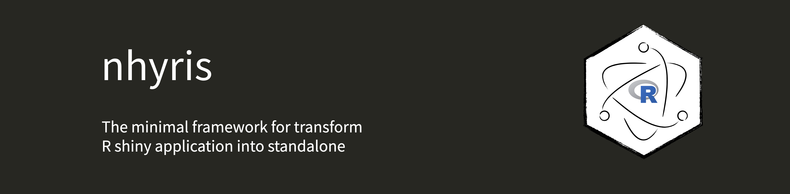

[](https://nodejs.org/)
[](https://nodejs.org/)
[](https://www.electronjs.org/)
[](https://www.electronforge.io/)
[](https://www.r-project.org/)
[](https://pak.r-lib.org/)

# nhyris

The minimal framework for transform R shiny application into standalone

## Prerequisites

Before installing **nhyris**, make sure you have the following installed:

- [Node.js](https://nodejs.org/) (v22.13.1 or higher recommended)
- [npm](https://www.npmjs.com/) (v11.4.1 or higher recommended)

You can check your versions with:

```sh
node -v
npm -v
```

## How to install

You can install nhyris globally using npm:

```sh
npm i -g nhyris
```

This will add the `nhyris` command to your PATH.

## How to use

You can use the following commands after installing nhyris:

- Initialize a new project (replace `myapp` with your project name):

```sh
nhyris init myapp
```

- Run your Shiny app in development mode:

```sh
nhyris run myapp
```

- Update dependencies and project files:

```sh
nhyris update myapp
```

- Build a standalone Electron application:

```sh
nhyris build myapp
```

## License

This project is licensed under the MIT License - see the [LICENSE](./LICENSE) file for details.

[](https://opensource.org/licenses/MIT)
